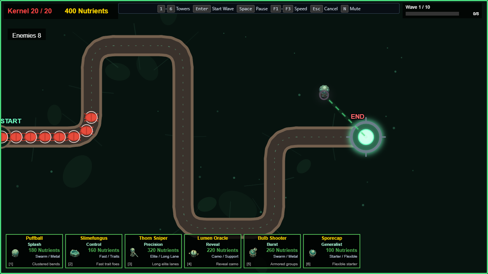

# MyceliumTD

MyceliumTD is a browser-based tower defense game about defending the Symbiosis
Kernel from escalating insect waves with a connected network of fungal towers.
The current vertical slice is a single ten-wave Garden Path run with six towers,
enemy traits, and permanent tower Evolutions.



## Play locally

Use Node.js 20 or later.

```sh
npm ci
npm run build
npm run serve
```

Then open [http://127.0.0.1:8080/](http://127.0.0.1:8080/) in your browser.
The game page, JavaScript bundle, music, sound effects, and tower sprites are
all served from that one root URL.

## First wave and controls

1. Click the game canvas and press <kbd>Enter</kbd> to begin.
2. Follow the first prompt: select **Sporecap** with <kbd>6</kbd> and place it
   inside the highlighted Kernel range.
3. Press <kbd>Enter</kbd> again, or click **Start Wave 1**, to begin the wave.

| Input | Action |
| --- | --- |
| <kbd>1</kbd>–<kbd>6</kbd> | Select a tower to place |
| Left click | Place/select a tower or activate a UI control |
| Right click / <kbd>Esc</kbd> | Cancel placement or deselect |
| <kbd>Enter</kbd> | Start the game or next wave |
| <kbd>Space</kbd> | Pause or resume |
| <kbd>F1</kbd>–<kbd>F3</kbd> | Change game speed |
| <kbd>N</kbd> | Toggle music mute |

## Current focus

The [playable vertical-slice gate](docs/vertical-slice-definition.md) defines
the release target and explicitly deferred systems. Progress is tracked in
[Issue #22](https://github.com/kenneth968/MyceliumTD/issues/22).

Some visuals and effects remain placeholder-quality while the release slice is
being polished; the gameplay, controls, and asset paths above are the supported
local play path.
